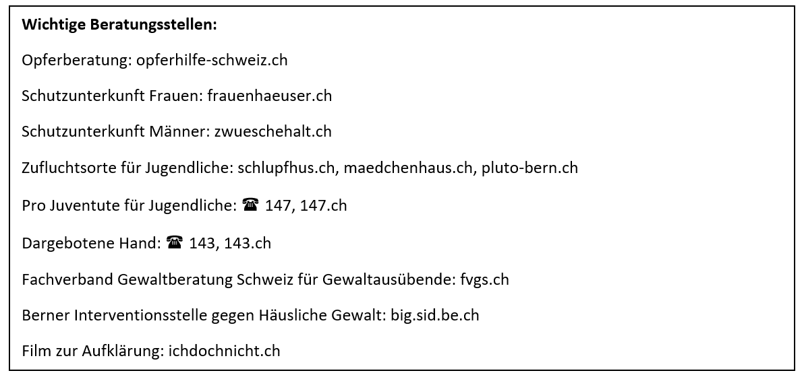
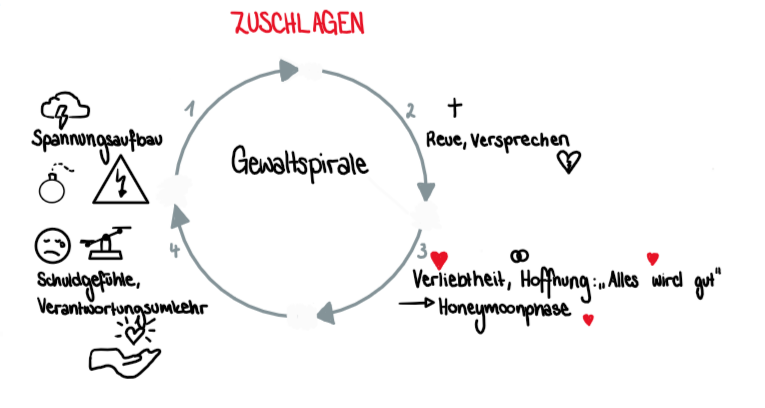

+++
title = "Reportage"
date = "2023-05-03"
draft = false
pinned = false
footnotes = "\\*sämtliche Namen von Autorinnen aus Datenschutzgründen geändert"
+++
# Alle zwei Wochen stirbt in der Schweiz eine Frau an den Folgen häuslicher Gewalt

Man kann von Glück reden, wenn man heutzutage noch nie Gewalt im eigenen Haus erfahren hat. Denn häusliche Gewalt kommt nicht, wie viele denken, nur in anderen Kulturkreisen oder Religionen vor. Häusliche Gewalt ist in allen Schichten der Gesellschaft zu finden. Jedoch wird viel zu wenig über dieses Thema gesprochen, deshalb haben wir es uns mit dieser Reportage zur Aufgabe gemacht, auch andere für dieses Thema zu sensibilisieren.

In einer Sommernacht im Jahr 2012 traf Nina\* als sie feiern ging, Kevin\*. Es war Liebe auf den ersten Blick. Bald darauf fand ihre Hochzeit statt und kurz nachher kam der erste Sohn, Robin\*, zwei Jahre später ihr zweiter Sohn Ivan\* auf die Welt. Die ersten paar Monate nach den Geburten waren schwierig für Nina, aber sie gewöhnte sich schnell an die neue Situation. Da ihr Mann als Oberarzt immer erst spät nach Hause kam, musste sie sich allein um die beiden Kinder kümmern.

Als wir das Gebäude des Amtes für Erwachsenen- und Kinderschutz betraten, hatte ich ein mulmiges Gefühl. Die Frau am Empfang bat uns Platz zu nehmen. Hier sassen wohl schon viele Menschen bedrückt mit den schlimmsten Schicksalen. Doch das mulmige Gefühl verzog sich, als eine freundliche und vertrauenswürdige Frau uns in ihr helles Büro bat. Uns gegenüber sass Frau Lena Feldmann in einem farbigen Pullover mit Blumenmuster, während sie uns von ihren Erfahrungen an der Fachstelle Häusliche Gewalt, aber auch von der früheren Arbeit im Frauenhaus berichtete. Sie erzählte uns, dass sie Erholung von der belastenden Arbeit zuhause bei ihrer Familie findet.

Wenn man doch immer wieder intakte Familien sieht, fragt man sich, warum es immer wieder vermehrt Gewalt in Haushalten gibt?

Gründe für Gewalt im eigenen Haus können skurril und verschieden sein, jedoch ist es wichtig, schon nach dem ersten Gewaltausbruch des Partners Hilfe zu suchen. Auch wenn dies nur bedeutet, sich einer engen Freundin oder einem engen Freund anzuvertrauen.

Trotzdem kochte Nina ihrem Mann und den Kindern jeden Abend eine frische Mahlzeit, doch eines Abends war sie so müde, dass sie auf dem Sofa einschlief. Als Kevin am Abend von der Arbeit heimkam, fragte er als erstes, was es denn zum Abendessen gebe. Darauf antwortete Nina, sie sei sehr erschöpft und hoffe, dass Kevin an diesem Abend kochen würde. Irritiert sagte Kevin, es sei ihre Verantwortung und dass sie nichts auf die Reihe kriege. Er verstehe nicht, wie sie von Haushaltsarbeit so müde sein könne, dabei sei er selbst derjenige, der erschöpft sein müsste. Nina war zutiefst entsetzt und meinte, dass den Haushalt zu führen nicht eine so einfache Arbeit sei. Die Stimmung wurde immer angespannter. Der bereits vor Wut kochende Kevin, schlug zu. Er gab ihr mit gestreckten Fingern eine Ohrfeige und sie fiel zu Boden. Vor Empörung weinend lief sie ins Schlafzimmer. Solche Vorfälle kamen später immer öfter vor. Nicht nur körperliche, sondern auch verbale Gewalt wurde zum Alltag. Wegen den Kindern blieb Nina jedoch bei Kevin sie sah keinen Ausweg aus der Ehe.

Die Opfer haben meist eine Art Tunnelblick, sie sehen keine andere Möglichkeit, als beim Partner zu bleiben wie Nina. Denn wenn man sich nicht aus einer gewalttätigen Beziehung befreit, kommt es häufig zur Gewaltspirale (vgl. Abb.). Die ersten Angriffe sind oft milder als die folgenden; die Gewalt steigert sich. Die Gewaltspirale ist grob in vier Phase unterteilt. In der ersten Phase kommt es zu Spannungen in der Beziehung, diese können ganz verschiedene Faktoren beinhalten, auch schon ein schlechter Tag kann ein Faktor sein. Irgendwann ist die Spannung so hoch, dass es zu einem Gewaltausbruch kommt.  Spannungsaufbau ist kennzeichnend für die erste Phase. Irgendwann bekommt der Gewalttätige in der Beziehung Schuldgefühle, die zweite Phase, und gibt Versprechen wie zum Beispiel: «Das wird nie wieder vorkommen.» Wenn dieses Versprechen nicht eingehalten wird, leitet die dritte Phase ein. Nach einer gewissen Zeit gewinnt die Person, die Gewalt erfahren hat wieder Hoffnung und Verliebtheit, deshalb wird die dritte Phase auch Honeymoon Phase genannt. In der vierten Phase plagen auch das gewalttätige Glied Schuldgefühle.

Als Nina endlich den Mut fasste, mit ihrer besten Freundin Mirjam* über die Gewalttätigkeit von Kevin zu sprechen, war diese sehr entsetzt. Kevin war doch immer so ein charmanter, freundlicher Kerl und höflich zu Mirjam. Das Schicksal von Nina bedrückte Mirjam so fest, dass sie eine Internet-Recherche betrieb und auf die Schweizer Opferhilfe stiess, sie vereinbarte einen Termin für die nächste Woche. Als Nina zu ihrem Termin erschien, war sie sehr froh, dass Mirjam ihr bei der Beratung zur Seite stand. Es wurde ihr klar, wie sie psychisch mit falschen Entschuldigungen und Versprechen manipuliert wurde. Nina wusste nun, dass es so nicht weiter ginge und trennte sich von Kevin. Heute lebt Nina mit ihren zwei Kindern allein und ist jeden Tag dankbar, nicht mehr Opfer von häuslicher Gewalt zu sein. 

Leider bleiben Opfer von häuslicher Gewalt in dieser immer sich wiederholenden Spirale stecken, wenn keine aussenstehende Person ihnen hinaushilft, wie Mirjam bei Nina. Aber was kann man tun, wenn Freunde/Bekannte unter häuslicher Gewalt leiden? Am besten ist es, erstmal der Person zuzuhören und Verständnis zu zeigen. Danach kann man sich Hilfe bei der Fachstelle Häusliche Gewalt, im Frauenhaus oder bei einer der anderen untenstehenden Adresse suchen. Häusliche Gewalt gab es schon immer und wird es in der Zukunft immer noch geben, wenn wir als Gesellschaft nicht dagegen ankämpfen.  

Für unser zweites Interview besuchten wir Frau Anna Werren. Sie arbeitet an der Interventionsstelle gegen Häusliche Gewalt, die sich mit der Täterarbeit beschäftigt. Denn es ist sehr wichtig dieses Thema, wie auch alle anderen von mehreren Perspektiven zu betrachten.

Bevor wir uns mit Frau Werren trafen, besuchten wir die Webseite der Berner Interventionsstelle. Ihr Beratungsangebot ist weitreichend, zuerst gibt es ein Erstgespräch danach eine Gruppenberatung in Form von Workshops aber auch Einzelgespräche, wenn eine Person, aus diversen Gründen nicht an einer Gruppenberatung teilnehmen kann. Jedoch werden meistens Gruppenberatungen empfohlen, denn so kann man auch noch von den Mitteilnehmenden profitieren. Es gab einmal einen Vorfall, wie sie uns berichtete, dass ein Polizist einen Workshop besuchen wollte, den er aber nicht antreten konnte, weil er selbst einen der Kursteilnehmer verhaftet hatte. Darum beanspruchte er dann ein Einzelgespräch. Die Workshops sind Teil eines Lernprogramms, dieses dauert 26 Abende, jeweils zwei Stunden und kostet pro Abend 20 CHF. Ziel ist die Wiedereingliederung von Tätern in die Gesellschaft. Die Kosten sind aber nie ein Problem, denn wenn jemand aus Kostengründen ein Angebot nicht besuchen kann, werden diese von der Beratungsstelle übernommen.

Viele Täter oder Personen, die befürchten zu häuslicher Gewalt zu tendieren, melden sich freiwillig bei der Interventionsstelle. Nur selten werden Personen von der Polizei eingeliefert, berichtet uns Frau Werren. Worauf zu schliessen ist, dass die Täter sich gar nicht als Täter identifizieren und aus dieser Rolle heraus möchten. Das jedoch widerlegt die häufig verwendete Aussage „Der Mensch sei böse.“

Gewalt kann angeboren sein, es ist dennoch viel wahrscheinlicher, dass es einem beigebracht wird, antwortete Frau Werren auf unsere Frage. Kinder lernen viel von ihren Erziehungsberechtigten, übernehmen ihr Verhalten und Handeln. Wenn Menschen im Kindesalter häusliche Gewalt erleben mussten, tragen sie ihr Leben lang psychische Schäden davon. Darum müssen bei solchen Vorfällen auch Fachpersonen auf Ihre Schweigepflicht verzichten und die KESB (Kinder- und Erwachsenenschutzbehörde) einschalten. Es gibt mehrere Studien, die belegen, dass Kinder, die häusliche Gewalt erfuhren, später selbst gewalttätig werden. Es gibt aber einen Ausweg aus diesem Teufelskreis. In der Schweiz gibt es zahlreiche Angebote, die man beanspruchen kann, wie z.B. die Fachstelle Häusliche Gewalt oder die Interventionsstelle gegen Häusliche Gewalt.

Die Gewalttätigkeit im eigenen Haushalt können unterschiedliche Ursachen zu Grunde liegen, fehlendes Selbstbewusstsein, Stress oder toxische Männlichkeit sind nicht selten einer der Gründe. Mit diesen Faktoren lernen die Teilnehmer eines Workshops umzugehen, die Verantwortung über die Situation zu erlangen fällt ihnen meistens schwer. Der Workshop beginnt oftmals mit Atemübungen, die die Menschen beruhigen. Täter plagt oft ein Schamgefühl über ihre eigenen Taten. Darum suchen sie oft Ausreden für ihr eigenes Verhalten, wie das Opfer habe sie provoziert, sie seien sehr temperamentvoll oder der Alkohol sei schuld am Geschehen. Um mit dieser Scham umgehen zu können, überwinden sich die Teilnehmer im Workshop zu Aktivitäten, die noch manch andern peinlich wären. Laut schreien gehört auch dazu. Wie ein Teilnehmer berichtet: »Zum einen war es mega befreiend mal wieder laut schreien zu können, aber in der gleichen Millisekunde dachte ich auch scheisse». Sie lernen die Gewalt unter Kontrolle zu bringen. Mehr Informationen gibt es noch auf der Webseite der Berner Interventionsstelle gegen Häusliche Gewalt.

Wir können dankbar sein, dass es in der Schweiz so viele Angebote zu diesem Thema gibt und man sich nicht schämen muss, wenn eine häusliche Gewalt widerfährt, denn tendenziell ist niemand sicher davor. Wichtig ist es, die angebotene Hilfe in Anspruch zu nehmen.

Zum Schluss möchten wir uns herzlich bei Frau Lena Feldmann von der Fachstelle Häusliche Gewalt und Frau Anna Werren von der Interventionsstelle gegen Häusliche Gewalt bedanken für ihre ehrlichen, nützlichen Aussagen und ihre Bereitschaft sich für ein Interview mit uns Zeit zu nehmen!